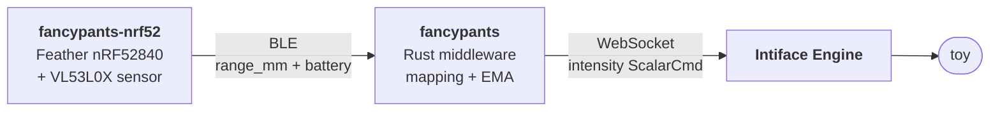

# Fancypants


<br/>
A two-part system that uses an nRF52840 + VL53L0X time-of-flight sensor to control
sex toys through Intiface Engine. "Wave your hand" closer to the sensor for more
intensity, pull away to reduce it — or flip it around, or drive intensity by how
fast you're moving (see `mapping.mode` in [docs/middleware.md](docs/middleware.md)).



## Quick start

Prebuilt binaries (firmware `.uf2` + Linux x86_64 middleware) are on the
[Releases page](../../releases) — download, flash, run. To build from source
you need `docker` (or `podman`) and `make`; everything builds in containers:

```bash
# 1. Build firmware + middleware
make

# 2. Flash the Feather: double-tap reset, then copy the UF2
#    (or `west flash` via SWD; `make flash` prints the details)
cp build/firmware/zephyr.uf2 /run/media/$USER/FTHR840BOOT/

# 3. Start Intiface Central with your toy connected, then run the middleware
#    (finds ./config.toml or ~/.config/fancypants/config.toml automatically,
#     and creates the latter on first run)
./build/middleware/fancypants
```

Move your hand near the sensor and enjoy.

## Documentation

- [Hardware & wiring](docs/hardware.md)
- [Building](docs/building.md) — build options, tests, manual (container-less) builds
- [Firmware](docs/firmware.md) — flashing, serial console, BLE protocol
- [Middleware](docs/middleware.md) — configuration, mapping modes, running
- [Troubleshooting](docs/troubleshooting.md)
- [Wearable design](wearable-design.md) — belt-mounted layout; printable
  enclosures in [enclosures/](enclosures/)

## License

MIT — see [LICENSE](LICENSE).
